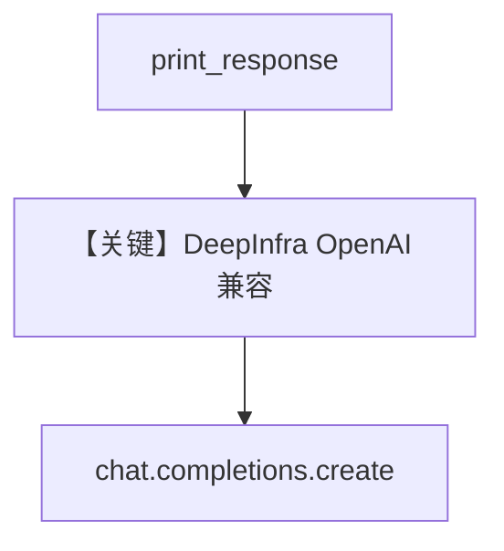

# basic.py — 实现原理分析

<!-- cookbook-py-source:start -->
## 完整源码

```python
"""
Deepinfra Basic
===============

Cookbook example for `deepinfra/basic.py`.
"""

from agno.agent import Agent, RunOutput  # noqa
from agno.models.deepinfra import DeepInfra  # noqa
import asyncio

# ---------------------------------------------------------------------------
# Create Agent
# ---------------------------------------------------------------------------

agent = Agent(
    model=DeepInfra(id="meta-llama/Llama-2-70b-chat-hf"),
    markdown=True,
)

# Get the response in a variable
# run: RunOutput = agent.run("Share a 2 sentence horror story")
# print(run.content)

# Print the response in the terminal

# ---------------------------------------------------------------------------
# Run Agent
# ---------------------------------------------------------------------------
if __name__ == "__main__":
    # --- Sync ---
    agent.print_response("Share a 2 sentence horror story")

    # --- Sync + Streaming ---
    agent.print_response("Share a 2 sentence horror story", stream=True)

    # --- Async ---
    asyncio.run(agent.aprint_response("Share a 2 sentence horror story"))

    # --- Async + Streaming ---
    asyncio.run(agent.aprint_response("Share a 2 sentence horror story", stream=True))
```

<!-- cookbook-py-source:end -->

> 源文件：`cookbook/90_models/deepinfra/basic.py`

## 概述

本示例展示 **DeepInfra（OpenAI 兼容）** 基础调用：`DeepInfra(id="meta-llama/Llama-2-70b-chat-hf")`，`base_url` 默认 `https://api.deepinfra.com/v1/openai`（见 `libs/agno/agno/models/deepinfra/deepinfra.py`）。

**核心配置一览：**

| 配置项 | 值 | 说明 |
|--------|------|------|
| `model` | `DeepInfra(id="meta-llama/Llama-2-70b-chat-hf")` | Chat Completions |
| `markdown` | `True` | Markdown system 段 |

## 完整 API 请求

`chat.completions.create`（`OpenAILike` → `OpenAIChat.invoke`）。

## Mermaid 流程图



## 关键源码文件索引

| 文件 | 关键函数/类 | 作用 |
|------|------------|------|
| `agno/models/deepinfra/deepinfra.py` | `DeepInfra` | 端点与密钥 |
| `agno/models/openai/chat.py` | `invoke()` | HTTP |
