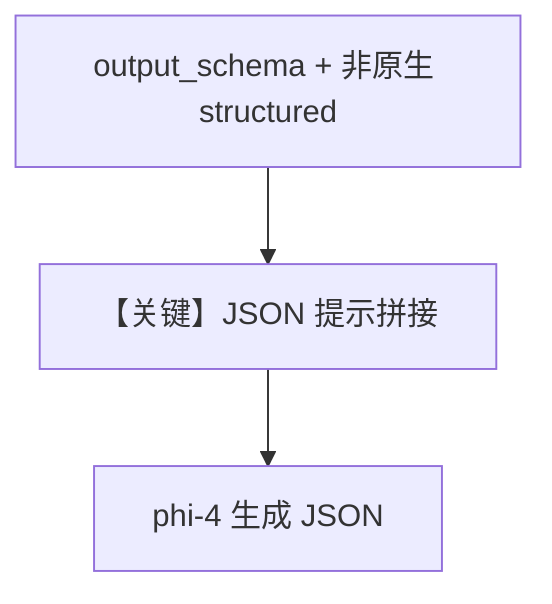

# json_output.py — 实现原理分析

<!-- cookbook-py-source:start -->
## 完整源码

```python
"""
Deepinfra Json Output
=====================

Cookbook example for `deepinfra/json_output.py`.
"""

from typing import List

from agno.agent import Agent, RunOutput  # noqa
from agno.models.deepinfra import DeepInfra  # noqa
from pydantic import BaseModel, Field
from rich.pretty import pprint  # noqa

# ---------------------------------------------------------------------------
# Create Agent
# ---------------------------------------------------------------------------


class MovieScript(BaseModel):
    setting: str = Field(
        ..., description="Provide a nice setting for a blockbuster movie."
    )
    ending: str = Field(
        ...,
        description="Ending of the movie. If not available, provide a happy ending.",
    )
    genre: str = Field(
        ...,
        description="Genre of the movie. If not available, select action, thriller or romantic comedy.",
    )
    name: str = Field(..., description="Give a name to this movie")
    characters: List[str] = Field(..., description="Name of characters for this movie.")
    storyline: str = Field(
        ..., description="3 sentence storyline for the movie. Make it exciting!"
    )


# Agent that uses JSON mode
agent = Agent(
    model=DeepInfra(id="microsoft/phi-4"),
    description="You write movie scripts.",
    output_schema=MovieScript,
)

# Get the response in a variable
# response: RunOutput = agent.run("New York")
# pprint(response.content)

agent.print_response("New York")

# ---------------------------------------------------------------------------
# Run Agent
# ---------------------------------------------------------------------------

if __name__ == "__main__":
    pass
```

<!-- cookbook-py-source:end -->

> 源文件：`cookbook/90_models/deepinfra/json_output.py`

## 概述

本示例展示 **DeepInfra + `output_schema`**：`MovieScript` 与 `description="You write movie scripts."`；**未**设置 `use_json_mode`（依赖解析链与模型能力）。`DeepInfra.supports_native_structured_outputs: bool = False`（`deepinfra.py` L29），更可能走 `get_json_output_prompt` 文本约束路径。

**核心配置一览：**

| 配置项 | 值 | 说明 |
|--------|------|------|
| `model` | `DeepInfra(id="microsoft/phi-4")` | Chat Completions |
| `description` | `You write movie scripts.` | `# 3.3.1` |
| `output_schema` | `MovieScript` | 结构化输出 |

## System Prompt 组装

### 还原后的完整 System 文本

```text
You write movie scripts.

（附加 get_json_output_prompt(MovieScript) 等，因 supports_native_structured_outputs=False，见 _messages.py #3.3.15）
```

## 完整 API 请求

`chat.completions.create` + `response_format` 或纯 JSON 提示依赖实现。

## Mermaid 流程图



## 关键源码文件索引

| 文件 | 关键函数/类 | 作用 |
|------|------------|------|
| `agno/models/deepinfra/deepinfra.py` | `supports_native_structured_outputs` | 能力位 |
| `agno/utils/prompts.py` | `get_json_output_prompt` | 文本 JSON 约束 |
