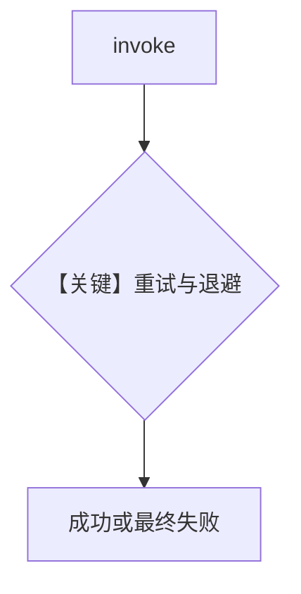

# retry.py — 实现原理分析

> 源文件：`cookbook/90_models/deepinfra/retry.py`

## 概述

故意使用 **`deepinfra-wrong-id`** 演示 **DeepInfra 重试**（`retries`、`delay_between_retries`、`exponential_backoff`）。

**核心配置一览：**

| 配置项 | 值 | 说明 |
|--------|------|------|
| `model` | `DeepInfra(id="deepinfra-wrong-id", retries=3, delay_between_retries=1, exponential_backoff=True)` | |

## 完整 API 请求

多次 `chat.completions.create` 尝试。

## Mermaid 流程图

## 关键源码文件索引

| 文件 | 关键函数/类 | 作用 |
|------|------------|------|
| `agno/models/deepinfra/deepinfra.py` | `DeepInfra` | API 配置 |
