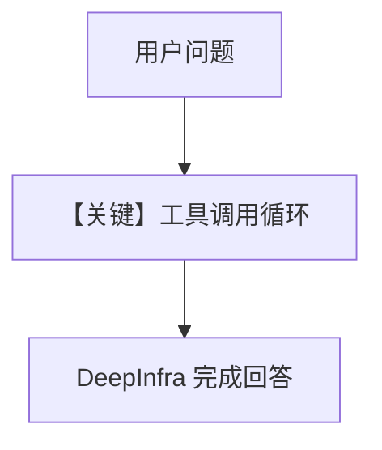

# tool_use.py — 实现原理分析

> 源文件：`cookbook/90_models/deepinfra/tool_use.py`

## 概述

**DeepInfra Llama-2-70b + WebSearchTools**（依赖 `ddgs` 等，见文件头注释）。

**核心配置一览：**

| 配置项 | 值 | 说明 |
|--------|------|------|
| `model` | `DeepInfra(id="meta-llama/Llama-2-70b-chat-hf")` | |
| `tools` | `[WebSearchTools()]` | |
| `markdown` | `True` | |

## 完整 API 请求

`chat.completions.create` with `tools`.

## Mermaid 流程图

## 关键源码文件索引

| 文件 | 关键函数/类 | 作用 |
|------|------------|------|
| `agno/models/openai/chat.py` | `invoke()` | 带 tools |
