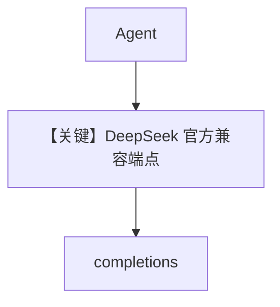

# basic.py — 实现原理分析

<!-- cookbook-py-source:start -->
## 完整源码

```python
"""
Deepseek Basic
==============

Cookbook example for `deepseek/basic.py`.
"""

from agno.agent import Agent, RunOutput  # noqa
from agno.models.deepseek import DeepSeek
import asyncio

# ---------------------------------------------------------------------------
# Create Agent
# ---------------------------------------------------------------------------

agent = Agent(model=DeepSeek(id="deepseek-chat"), markdown=True)

# Get the response in a variable
# run: RunOutput = agent.run("Share a 2 sentence horror story")
# print(run.content)

# Print the response in the terminal

# ---------------------------------------------------------------------------
# Run Agent
# ---------------------------------------------------------------------------
if __name__ == "__main__":
    # --- Sync ---
    agent.print_response("Share a 2 sentence horror story")

    # --- Sync + Streaming ---
    agent.print_response("Share a 2 sentence horror story", stream=True)

    # --- Async ---
    asyncio.run(agent.aprint_response("Share a 2 sentence horror story"))

    # --- Async + Streaming ---
    asyncio.run(agent.aprint_response("Share a 2 sentence horror story", stream=True))
```

<!-- cookbook-py-source:end -->

> 源文件：`cookbook/90_models/deepseek/basic.py`

## 概述

**DeepSeek Chat 兼容 API**（`DeepSeek`，`base_url` 默认 `https://api.deepseek.com`，`deepseek.py`）基础示例。

**核心配置一览：**

| 配置项 | 值 | 说明 |
|--------|------|------|
| `model` | `DeepSeek(id="deepseek-chat")` | Chat Completions |
| `markdown` | `True` | |

## 完整 API 请求

`chat.completions.create` via `OpenAILike`.

## Mermaid 流程图



## 关键源码文件索引

| 文件 | 关键函数/类 | 作用 |
|------|------------|------|
| `agno/models/deepseek/deepseek.py` | `DeepSeek` | 密钥与端点 |
