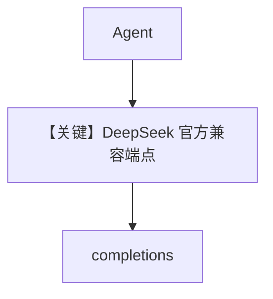

# basic.py — 实现原理分析

> 源文件：`cookbook/90_models/deepseek/basic.py`

## 概述

**DeepSeek Chat 兼容 API**（`DeepSeek`，`base_url` 默认 `https://api.deepseek.com`，`deepseek.py`）基础示例。

**核心配置一览：**

| 配置项 | 值 | 说明 |
|--------|------|------|
| `model` | `DeepSeek(id="deepseek-chat")` | Chat Completions |
| `markdown` | `True` | |

## 完整 API 请求

`chat.completions.create` via `OpenAILike`.

## Mermaid 流程图

## 关键源码文件索引

| 文件 | 关键函数/类 | 作用 |
|------|------------|------|
| `agno/models/deepseek/deepseek.py` | `DeepSeek` | 密钥与端点 |
