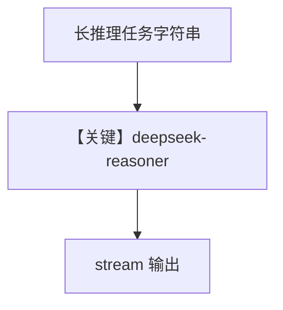

# reasoning_agent.py — 实现原理分析

<!-- cookbook-py-source:start -->
## 完整源码

```python
"""
Deepseek Reasoning Agent
========================

Cookbook example for `deepseek/reasoning_agent.py`.
"""

from agno.agent import Agent
from agno.models.deepseek import DeepSeek

# ---------------------------------------------------------------------------
# Create Agent
# ---------------------------------------------------------------------------

task = (
    "Three missionaries and three cannibals need to cross a river. "
    "They have a boat that can carry up to two people at a time. "
    "If, at any time, the cannibals outnumber the missionaries on either side of the river, the cannibals will eat the missionaries. "
    "How can all six people get across the river safely? Provide a step-by-step solution and show the solutions as an ascii diagram"
)

agent = Agent(
    model=DeepSeek(
        id="deepseek-reasoner",
    ),
    markdown=True,
)
agent.print_response(task, stream=True)

# ---------------------------------------------------------------------------
# Run Agent
# ---------------------------------------------------------------------------

if __name__ == "__main__":
    pass
```

<!-- cookbook-py-source:end -->

> 源文件：`cookbook/90_models/deepseek/reasoning_agent.py`

## 概述

**`deepseek-reasoner`** 做传教士过河类逻辑题，**流式**输出。

**核心配置一览：**

| 配置项 | 值 | 说明 |
|--------|------|------|
| `model` | `DeepSeek(id="deepseek-reasoner")` | 推理向模型 |
| `markdown` | `True` | |
| `stream` | `print_response(..., stream=True)` | 流式 |

## 完整 API 请求

流式 `chat.completions.create`（或等价 stream API）。

## Mermaid 流程图



## 关键源码文件索引

| 文件 | 关键函数/类 | 作用 |
|------|------------|------|
| `agno/models/deepseek/deepseek.py` | `DeepSeek` | |
