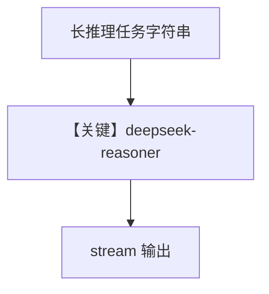

# reasoning_agent.py — 实现原理分析

> 源文件：`cookbook/90_models/deepseek/reasoning_agent.py`

## 概述

**`deepseek-reasoner`** 做传教士过河类逻辑题，**流式**输出。

**核心配置一览：**

| 配置项 | 值 | 说明 |
|--------|------|------|
| `model` | `DeepSeek(id="deepseek-reasoner")` | 推理向模型 |
| `markdown` | `True` | |
| `stream` | `print_response(..., stream=True)` | 流式 |

## 完整 API 请求

流式 `chat.completions.create`（或等价 stream API）。

## Mermaid 流程图

## 关键源码文件索引

| 文件 | 关键函数/类 | 作用 |
|------|------------|------|
| `agno/models/deepseek/deepseek.py` | `DeepSeek` | |
