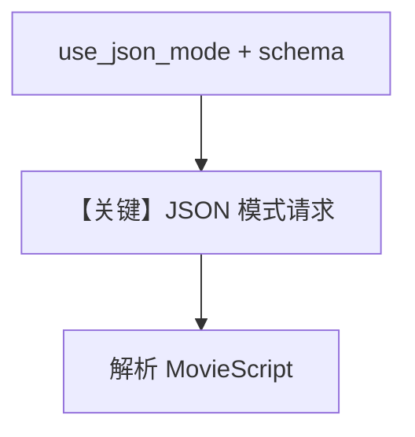

# structured_output.py — 实现原理分析

<!-- cookbook-py-source:start -->
## 完整源码

```python
"""
Deepseek Structured Output
==========================

Cookbook example for `deepseek/structured_output.py`.
"""

from typing import List

from agno.agent import Agent, RunOutput  # noqa
from agno.models.deepseek import DeepSeek
from pydantic import BaseModel, Field
from rich.pretty import pprint  # noqa

# ---------------------------------------------------------------------------
# Create Agent
# ---------------------------------------------------------------------------


class MovieScript(BaseModel):
    setting: str = Field(
        ..., description="Provide a nice setting for a blockbuster movie."
    )
    ending: str = Field(
        ...,
        description="Ending of the movie. If not available, provide a happy ending.",
    )
    genre: str = Field(
        ...,
        description="Genre of the movie. If not available, select action, thriller or romantic comedy.",
    )
    name: str = Field(..., description="Give a name to this movie")
    characters: List[str] = Field(..., description="Name of characters for this movie.")
    storyline: str = Field(
        ..., description="3 sentence storyline for the movie. Make it exciting!"
    )


json_mode_agent = Agent(
    model=DeepSeek(id="deepseek-chat"),
    description="You help people write movie scripts.",
    output_schema=MovieScript,
    use_json_mode=True,
)

# Get the response in a variable
json_mode_response: RunOutput = json_mode_agent.run("New York")
pprint(json_mode_response.content)

# json_mode_agent.print_response("New York")

# ---------------------------------------------------------------------------
# Run Agent
# ---------------------------------------------------------------------------

if __name__ == "__main__":
    pass
```

<!-- cookbook-py-source:end -->

> 源文件：`cookbook/90_models/deepseek/structured_output.py`

## 概述

**DeepSeek + `output_schema` + `use_json_mode=True`**；`MovieScript` 与 `description="You help people write movie scripts."`。`DeepSeek` 标注 `supports_native_structured_outputs: bool = False`（`deepseek.py` L33-34），JSON 依赖提示与解析。

**核心配置一览：**

| 配置项 | 值 | 说明 |
|--------|------|------|
| `model` | `DeepSeek(id="deepseek-chat")` | |
| `description` | `You help people write movie scripts.` | 字面量 |
| `output_schema` | `MovieScript` | |
| `use_json_mode` | `True` | |

## System Prompt 组装

### 还原后的完整 System 文本

```text
You help people write movie scripts.

（以及 get_json_output_prompt 等动态段）
```

## Mermaid 流程图



## 关键源码文件索引

| 文件 | 关键函数/类 | 作用 |
|------|------------|------|
| `agno/agent/_messages.py` | `# 3.3.15` | JSON 提示 |
| `agno/models/deepseek/deepseek.py` | `supports_native_structured_outputs` | False |
