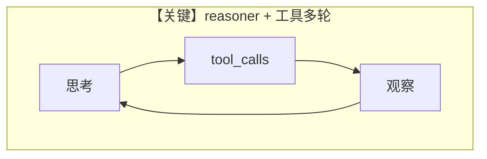

# thinking_tool_calls.py — 实现原理分析

> 源文件：`cookbook/90_models/deepseek/thinking_tool_calls.py`

## 概述

**`deepseek-reasoner` + WebSearchTools**；文件头说明 DeepSeek 思考模式可与工具多轮结合。`Agent` 上 **`stream=True`** 为默认流式行为；`print_response(..., show_full_reasoning=True)` 展示推理过程。

**核心配置一览：**

| 配置项 | 值 | 说明 |
|--------|------|------|
| `model` | `DeepSeek(id="deepseek-reasoner")` | |
| `tools` | `[WebSearchTools()]` | |
| `markdown` | `True` | |
| `stream` | `True` | Agent 级默认流式 |

## 运行机制与因果链

1. **路径**：推理模型在多轮中交替思考与调用搜索工具。
2. **差异**：`tool_use.py` 使用 `deepseek-chat` 且注释提示 function calling 不稳定。

## 完整 API 请求

`chat.completions.create` + tools + 流式；DeepSeek 特有 reasoning 字段由客户端解析。

## Mermaid 流程图

## 关键源码文件索引

| 文件 | 关键函数/类 | 作用 |
|------|------------|------|
| `agno/models/deepseek/deepseek.py` | `DeepSeek` | |
