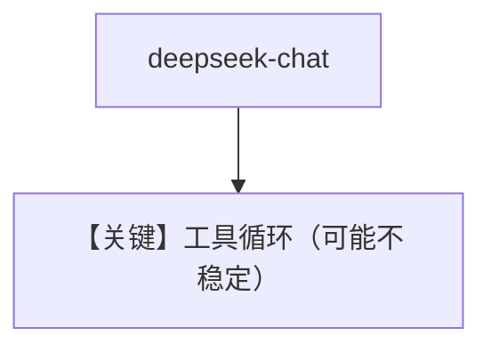

# tool_use.py — 实现原理分析

<!-- cookbook-py-source:start -->
## 完整源码

```python
"""Run `uv pip install ddgs` to install dependencies."""

import asyncio

from agno.agent import Agent
from agno.models.deepseek import DeepSeek
from agno.tools.websearch import WebSearchTools

# ---------------------------------------------------------------------------
# Create Agent
# ---------------------------------------------------------------------------

"""
The current version of the deepseek-chat model's Function Calling capabilitity is unstable, which may result in looped calls or empty responses.
Their development team is actively working on a fix, and it is expected to be resolved in the next version.
"""

agent = Agent(
    model=DeepSeek(id="deepseek-chat"),
    tools=[WebSearchTools()],
    markdown=True,
)

# ---------------------------------------------------------------------------
# Run Agent
# ---------------------------------------------------------------------------
if __name__ == "__main__":
    # --- Sync ---
    agent.print_response("Whats happening in France?")

    # --- Async + Streaming ---
    asyncio.run(agent.aprint_response("Whats happening in France?", stream=True))
```

<!-- cookbook-py-source:end -->

> 源文件：`cookbook/90_models/deepseek/tool_use.py`

## 概述

**`deepseek-chat` + WebSearchTools**；注释说明当前 FC 能力不稳定可能死循环或空回复。

**核心配置一览：**

| 配置项 | 值 | 说明 |
|--------|------|------|
| `model` | `DeepSeek(id="deepseek-chat")` | |
| `tools` | `[WebSearchTools()]` | |
| `markdown` | `True` | |

## 运行机制与因果链

与 `thinking_tool_calls.py`（reasoner）对照：本文件用 chat 型号做基础工具演示。

## Mermaid 流程图



## 关键源码文件索引

| 文件 | 关键函数/类 | 作用 |
|------|------------|------|
| `agno/tools/websearch.py` | `WebSearchTools` | |
