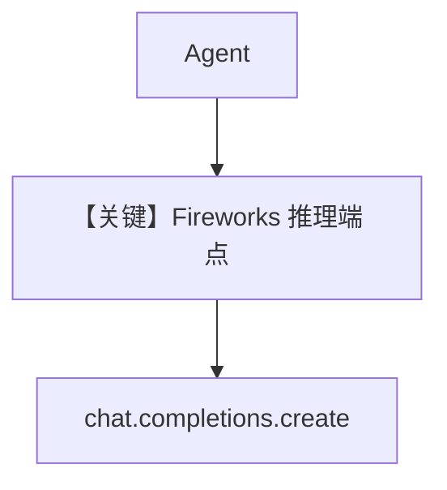

# basic.py — 实现原理分析

<!-- cookbook-py-source:start -->
## 完整源码

```python
"""
Fireworks Basic
===============

Cookbook example for `fireworks/basic.py`.
"""

from agno.agent import Agent, RunOutput  # noqa
from agno.models.fireworks import Fireworks
import asyncio

# ---------------------------------------------------------------------------
# Create Agent
# ---------------------------------------------------------------------------

agent = Agent(
    model=Fireworks(id="accounts/fireworks/models/llama-v3p1-405b-instruct"),
    markdown=True,
)

# Get the response in a variable
# run: RunOutput = agent.run("Share a 2 sentence horror story")
# print(run.content)

# Print the response in the terminal

# ---------------------------------------------------------------------------
# Run Agent
# ---------------------------------------------------------------------------
if __name__ == "__main__":
    # --- Sync ---
    agent.print_response("Share a 2 sentence horror story")

    # --- Sync + Streaming ---
    agent.print_response("Share a 2 sentence horror story", stream=True)

    # --- Async ---
    asyncio.run(agent.aprint_response("Share a 2 sentence horror story"))

    # --- Async + Streaming ---
    asyncio.run(agent.aprint_response("Share a 2 sentence horror story", stream=True))
```

<!-- cookbook-py-source:end -->

> 源文件：`cookbook/90_models/fireworks/basic.py`

## 概述

**Fireworks** OpenAI 兼容 API（`base_url` 默认 `https://api.fireworks.ai/inference/v1`），模型 `accounts/fireworks/models/llama-v3p1-405b-instruct`。

**核心配置一览：**

| 配置项 | 值 | 说明 |
|--------|------|------|
| `model` | `Fireworks(id="accounts/fireworks/models/llama-v3p1-405b-instruct")` | Chat Completions |
| `markdown` | `True` | |

## Mermaid 流程图



## 关键源码文件索引

| 文件 | 关键函数/类 | 作用 |
|------|------------|------|
| `agno/models/fireworks/fireworks.py` | `Fireworks` | |
