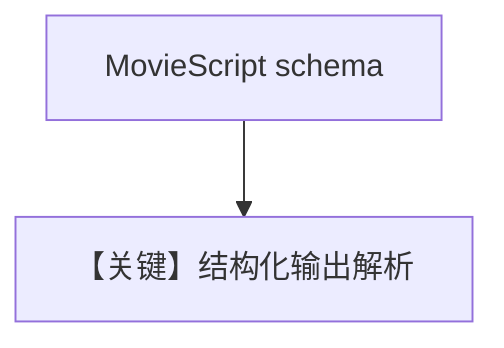

# structured_output.py — 实现原理分析

> 源文件：`cookbook/90_models/fireworks/structured_output.py`

## 概述

**Fireworks + `output_schema`**，`description="You write movie scripts."`，`agent.run("New York")` + `pprint`。

**核心配置一览：**

| 配置项 | 值 | 说明 |
|--------|------|------|
| `model` | `Fireworks(id="accounts/fireworks/models/llama-v3p1-405b-instruct")` | |
| `description` | `You write movie scripts.` | 字面量 |
| `output_schema` | `MovieScript` | |

## System Prompt 组装

### 还原后的完整 System 文本

```text
You write movie scripts.

（动态 JSON/schema 提示段）
```

## Mermaid 流程图



## 关键源码文件索引

| 文件 | 关键函数/类 | 作用 |
|------|------------|------|
| `agno/agent/_messages.py` | `get_system_message` | schema 段 |
