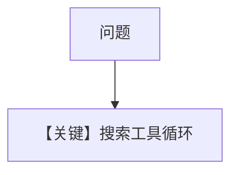

# tool_use.md — 实现原理分析

<!-- cookbook-py-source:start -->
## 完整源码

```python
"""Run `uv pip install ddgs` to install dependencies."""

import asyncio

from agno.agent import Agent
from agno.models.fireworks import Fireworks
from agno.tools.websearch import WebSearchTools

# ---------------------------------------------------------------------------
# Create Agent
# ---------------------------------------------------------------------------

agent = Agent(
    model=Fireworks(id="accounts/fireworks/models/llama-v3p1-405b-instruct"),
    tools=[WebSearchTools()],
    markdown=True,
)

# ---------------------------------------------------------------------------
# Run Agent
# ---------------------------------------------------------------------------
if __name__ == "__main__":
    # --- Sync + Streaming ---
    agent.print_response("Whats happening in France?", stream=True)

    # --- Async + Streaming ---
    asyncio.run(agent.aprint_response("Whats happening in France?", stream=True))
```

<!-- cookbook-py-source:end -->

> 源文件：`cookbook/90_models/fireworks/tool_use.py`

## 概述

**Fireworks Llama-3.1-405B + WebSearchTools**，同步/异步流式。

**核心配置一览：**

| 配置项 | 值 | 说明 |
|--------|------|------|
| `model` | `Fireworks(id="accounts/fireworks/models/llama-v3p1-405b-instruct")` | |
| `tools` | `[WebSearchTools()]` | |
| `markdown` | `True` | |

## Mermaid 流程图



## 关键源码文件索引

| 文件 | 关键函数/类 | 作用 |
|------|------------|------|
| `agno/models/openai/chat.py` | `invoke()` | tools |
