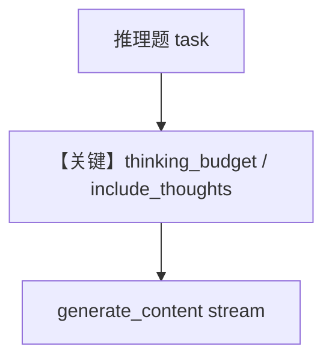

# agent_with_thinking_budget.py — 实现原理分析

> 源文件：`cookbook/90_models/google/gemini/agent_with_thinking_budget.py`

## 概述

本示例展示 **Gemini `thinking_budget` + `include_thoughts`**（需 `google-genai > 1.10.0`）：`gemini-2.5-pro` 上设置 `thinking_budget=1280`。

**核心配置一览：**

| 配置项 | 值 | 说明 |
|--------|------|------|
| `model` | `Gemini(id="gemini-2.5-pro", thinking_budget=1280, include_thoughts=True)` | 见 `libs/agno/agno/models/google/gemini.py` 请求参数 |
| `markdown` | `True` | |

## 完整 API 请求

```python
# gemini.py L527-531
get_client().models.generate_content(
    model="gemini-2.5-pro",
    contents=formatted_messages,
    **request_kwargs,  # 含 thinking 相关配置
)
```

## Mermaid 流程图



## 关键源码文件索引

| 文件 | 关键函数/类 | 作用 |
|------|------------|------|
| `agno/models/google/gemini.py` | `invoke()` / `get_request_params` | thinking 参数 |
| `agno/agent/_messages.py` | `get_system_message()` | system 文本 |
