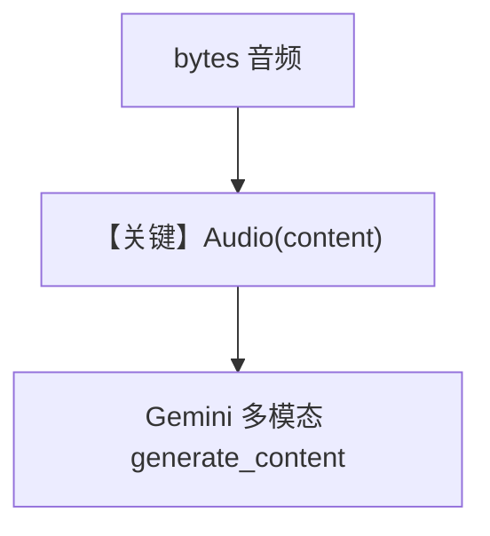

# audio_input_bytes_content.py — 实现原理分析

> 源文件：`cookbook/90_models/google/gemini/audio_input_bytes_content.py`

## 概述

**音频字节** 输入：`Audio(content=audio_content)`，`requests` 下载 WAV，`gemini-3-flash-preview`。

**核心配置一览：**

| 配置项 | 值 | 说明 |
|--------|------|------|
| `model` | `Gemini(id="gemini-3-flash-preview")` | |
| `markdown` | `True` | |
| 用户消息 | `audio=[Audio(content=...)]` | 多模态 |

## 完整 API 请求

`generate_content`；`contents` 由 `_format_messages` 含音频部分。

## Mermaid 流程图

## 关键源码文件索引

| 文件 | 关键函数/类 | 作用 |
|------|------------|------|
| `agno/models/google/gemini.py` | `_format_messages` | 音频并入 contents |
