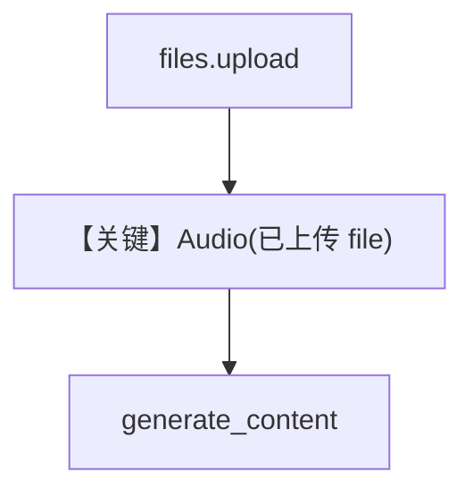

# audio_input_file_upload.py — 实现原理分析

<!-- cookbook-py-source:start -->
## 完整源码

```python
"""
Google Audio Input File Upload
==============================

Cookbook example for `google/gemini/audio_input_file_upload.py`.
"""

from pathlib import Path

from agno.agent import Agent
from agno.media import Audio
from agno.models.google import Gemini
from google.genai.types import UploadFileConfig

# ---------------------------------------------------------------------------
# Create Agent
# ---------------------------------------------------------------------------

model = Gemini(id="gemini-3-flash-preview")
agent = Agent(
    model=model,
    markdown=True,
)

# Please download a sample audio file to test this Agent and upload using:
audio_path = Path(__file__).parent.joinpath("sample.mp3")
audio_file = None

remote_file_name = f"files/{audio_path.stem.lower()}"
try:
    audio_file = model.get_client().files.get(name=remote_file_name)
except Exception as e:
    print(f"Error getting file {audio_path.stem}: {e}")
    pass

if not audio_file:
    try:
        audio_file = model.get_client().files.upload(
            file=audio_path,
            config=UploadFileConfig(name=audio_path.stem, display_name=audio_path.stem),
        )
        print(f"Uploaded audio: {audio_file}")
    except Exception as e:
        print(f"Error uploading audio: {e}")

agent.print_response(
    "Tell me about this audio",
    audio=[Audio(content=audio_file)],
    stream=True,
)

# ---------------------------------------------------------------------------
# Run Agent
# ---------------------------------------------------------------------------

if __name__ == "__main__":
    pass
```

<!-- cookbook-py-source:end -->

> 源文件：`cookbook/90_models/google/gemini/audio_input_file_upload.py`

## 概述

**先上传 Google Files API** 再传 `Audio(content=audio_file)`：`model.get_client().files.upload`，`Audio(content=audio_file)` 使用上传后的文件引用。

**核心配置一览：**

| 配置项 | 值 | 说明 |
|--------|------|------|
| `model` | `Gemini(id="gemini-3-flash-preview")` | 需本地 `sample.mp3` |

## 运行机制与因果链

文件需 `PROCESSING` 完成后才能用于生成；示例含获取/上传逻辑。

## 完整 API 请求

`generate_content` + 文件引用型内容。

## Mermaid 流程图



## 关键源码文件索引

| 文件 | 关键函数/类 | 作用 |
|------|------------|------|
| `agno/models/google/gemini.py` | `Gemini.get_client()` | google-genai 客户端 |
