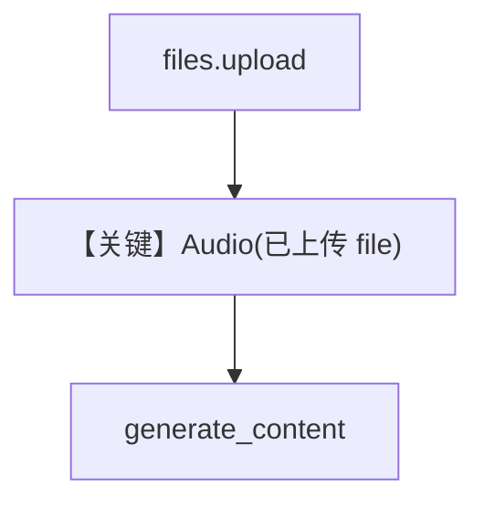

# audio_input_file_upload.py — 实现原理分析

> 源文件：`cookbook/90_models/google/gemini/audio_input_file_upload.py`

## 概述

**先上传 Google Files API** 再传 `Audio(content=audio_file)`：`model.get_client().files.upload`，`Audio(content=audio_file)` 使用上传后的文件引用。

**核心配置一览：**

| 配置项 | 值 | 说明 |
|--------|------|------|
| `model` | `Gemini(id="gemini-3-flash-preview")` | 需本地 `sample.mp3` |

## 运行机制与因果链

文件需 `PROCESSING` 完成后才能用于生成；示例含获取/上传逻辑。

## 完整 API 请求

`generate_content` + 文件引用型内容。

## Mermaid 流程图

## 关键源码文件索引

| 文件 | 关键函数/类 | 作用 |
|------|------------|------|
| `agno/models/google/gemini.py` | `Gemini.get_client()` | google-genai 客户端 |
