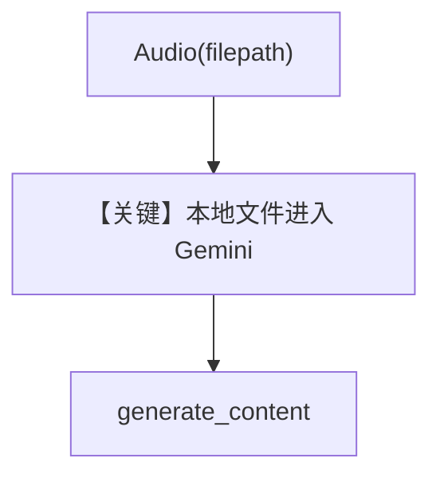

# audio_input_local_file_upload.py — 实现原理分析

> 源文件：`cookbook/90_models/google/gemini/audio_input_local_file_upload.py`

## 概述

**本地路径** 上传：`Audio(filepath=audio_path)`，`gemini-3-flash-preview`，由框架/适配器处理上传与大文件规则。

**核心配置一览：**

| 配置项 | 值 | 说明 |
|--------|------|------|
| `model` | `Gemini(id="gemini-3-flash-preview")` | |
| `markdown` | `True` | |

## 完整 API 请求

`generate_content`；本地文件可能经 Files API 自动上传（见 Agno 与 google-genai 行为）。

## Mermaid 流程图

## 关键源码文件索引

| 文件 | 关键函数/类 | 作用 |
|------|------------|------|
| `agno/media/audio.py` | `Audio` | filepath 承载 |
