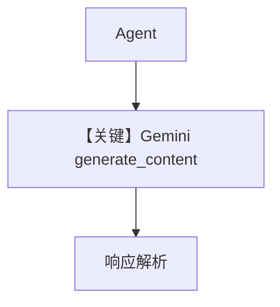

# basic.py — 实现原理分析

<!-- cookbook-py-source:start -->
## 完整源码

```python
"""
Google Basic
============

Cookbook example for `google/gemini/basic.py`.
"""

from agno.agent import Agent, RunOutput  # noqa
from agno.models.google import Gemini
import asyncio

# ---------------------------------------------------------------------------
# Create Agent
# ---------------------------------------------------------------------------

agent = Agent(model=Gemini(id="gemini-3-flash-preview"), markdown=True)

# Get the response in a variable
# run: RunOutput = agent.run("Share a 2 sentence horror story")
# print(run.content)

# Print the response in the terminal

# ---------------------------------------------------------------------------
# Run Agent
# ---------------------------------------------------------------------------
if __name__ == "__main__":
    # --- Sync ---
    agent.print_response("Share a 2 sentence horror story")

    # --- Sync + Streaming ---
    agent.print_response("Share a 2 sentence horror story", stream=True)

    # --- Async ---
    asyncio.run(agent.aprint_response("Share a 2 sentence horror story"))

    # --- Async + Streaming ---
    asyncio.run(agent.aprint_response("Share a 2 sentence horror story", stream=True))
```

<!-- cookbook-py-source:end -->

> 源文件：`cookbook/90_models/google/gemini/basic.py`

## 概述

**Gemini 基础**：`Gemini(id="gemini-3-flash-preview")`，同步/异步与流式。

**核心配置一览：**

| 配置项 | 值 | 说明 |
|--------|------|------|
| `model` | `Gemini(id="gemini-3-flash-preview")` | **非** OpenAI Chat Completions，使用 `generate_content` |
| `markdown` | `True` | |

## 完整 API 请求

```python
# agno/models/google/gemini.py L527-530
get_client().models.generate_content(model=self.id, contents=formatted_messages, **request_kwargs)
```

## Mermaid 流程图



## 关键源码文件索引

| 文件 | 关键函数/类 | 作用 |
|------|------------|------|
| `agno/models/google/gemini.py` | `invoke()` L507+ | Google GenAI SDK |
