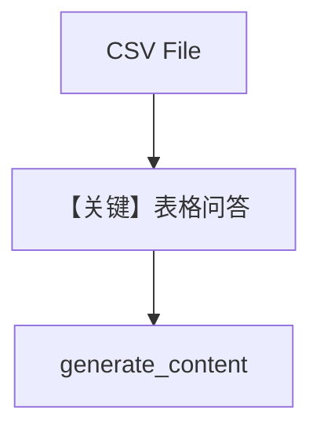

# csv_input.py — 实现原理分析

<!-- cookbook-py-source:start -->
## 完整源码

```python
"""
Google Csv Input
================

Cookbook example for `google/gemini/csv_input.py`.
"""

from pathlib import Path

from agno.agent import Agent
from agno.media import File
from agno.models.google import Gemini
from agno.utils.media import download_file

# ---------------------------------------------------------------------------
# Create Agent
# ---------------------------------------------------------------------------

csv_path = Path(__file__).parent.joinpath("IMDB-Movie-Data.csv")

download_file(
    "https://agno-public.s3.amazonaws.com/demo_data/IMDB-Movie-Data.csv", str(csv_path)
)

agent = Agent(
    model=Gemini(id="gemini-2.5-flash"),
    markdown=True,
)

agent.print_response(
    "Analyze the top 10 highest-grossing movies in this dataset. Which genres perform best at the box office?",
    files=[
        File(
            filepath=csv_path,
            mime_type="text/csv",
        ),
    ],
)

# ---------------------------------------------------------------------------
# Run Agent
# ---------------------------------------------------------------------------

if __name__ == "__main__":
    pass
```

<!-- cookbook-py-source:end -->

> 源文件：`cookbook/90_models/google/gemini/csv_input.py`

## 概述

**表格文件** 分析：`File(filepath=..., mime_type="text/csv")`，下载 IMDB CSV，`gemini-2.5-flash`。

**核心配置一览：**

| 配置项 | 值 | 说明 |
|--------|------|------|
| `model` | `Gemini(id="gemini-2.5-flash")` | |
| `markdown` | `True` | |

## 完整 API 请求

`generate_content`，`files` 进入多模态 contents。

## Mermaid 流程图



## 关键源码文件索引

| 文件 | 关键函数/类 | 作用 |
|------|------------|------|
| `agno/media/file.py` | `File` | filepath + mime |
