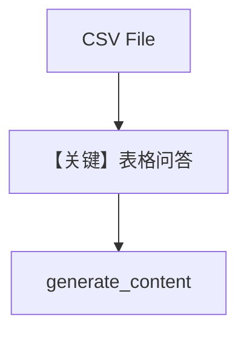

# csv_input.py — 实现原理分析

> 源文件：`cookbook/90_models/google/gemini/csv_input.py`

## 概述

**表格文件** 分析：`File(filepath=..., mime_type="text/csv")`，下载 IMDB CSV，`gemini-2.5-flash`。

**核心配置一览：**

| 配置项 | 值 | 说明 |
|--------|------|------|
| `model` | `Gemini(id="gemini-2.5-flash")` | |
| `markdown` | `True` | |

## 完整 API 请求

`generate_content`，`files` 进入多模态 contents。

## Mermaid 流程图

## 关键源码文件索引

| 文件 | 关键函数/类 | 作用 |
|------|------------|------|
| `agno/media/file.py` | `File` | filepath + mime |
