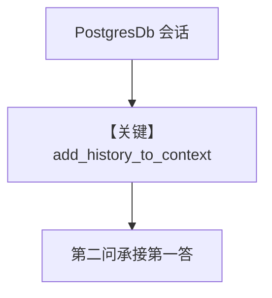

# db.py — 实现原理分析

<!-- cookbook-py-source:start -->
## 完整源码

```python
"""Run `uv pip install ddgs sqlalchemy google.genai` to install dependencies."""

from agno.agent import Agent
from agno.db.postgres import PostgresDb
from agno.models.google import Gemini
from agno.tools.websearch import WebSearchTools

# ---------------------------------------------------------------------------
# Create Agent
# ---------------------------------------------------------------------------

# Setup the database
db_url = "postgresql+psycopg://ai:ai@localhost:5532/ai"
db = PostgresDb(db_url=db_url)

agent = Agent(
    model=Gemini(id="gemini-3-flash-preview"),
    db=db,
    tools=[WebSearchTools()],
    add_history_to_context=True,
)
agent.print_response("How many people live in Canada?")
agent.print_response("What is their national anthem called?")

# ---------------------------------------------------------------------------
# Run Agent
# ---------------------------------------------------------------------------

if __name__ == "__main__":
    pass
```

<!-- cookbook-py-source:end -->

> 源文件：`cookbook/90_models/google/gemini/db.md`

## 概述

**PostgresDb + WebSearchTools + 多轮**：加拿大人口与国歌追问，依赖会话存储。

**核心配置一览：**

| 配置项 | 值 | 说明 |
|--------|------|------|
| `model` | `Gemini(id="gemini-3-flash-preview")` | |
| `db` | `PostgresDb(db_url=...)` | 生产型存储（示例连本地 5532） |
| `tools` | `[WebSearchTools()]` | |
| `add_history_to_context` | `True` | 第二轮可见第一轮 |

## System Prompt 组装

含工具说明；若开启历史，user/assistant 轮次进入 `get_run_messages`。

## 完整 API 请求

`generate_content` + tools；messages 含多轮历史。

## Mermaid 流程图



## 关键源码文件索引

| 文件 | 关键函数/类 | 作用 |
|------|------------|------|
| `agno/db/postgres/postgres.py` | `PostgresDb` | 会话 |
| `agno/models/google/gemini.py` | `invoke()` | |
