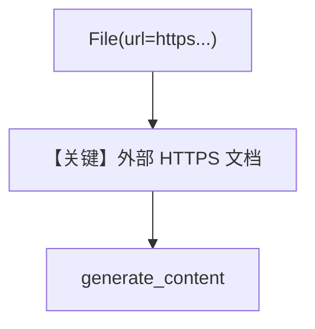

# external_url_input.py — 实现原理分析

> 源文件：`cookbook/90_models/google/gemini/external_url_input.py`

## 概述

**公网 HTTPS URL 直传** PDF（无需本地下载），需 **Gemini 3.x**；`File(url=..., mime_type="application/pdf")`。

**核心配置一览：**

| 配置项 | 值 | 说明 |
|--------|------|------|
| `model` | `Gemini(id="gemini-3-flash-preview")` | |
| `markdown` | `True` | |

## 运行机制与因果链

Gemini 服务端拉取 URL 内容；区别于本地上传与 GCS。

## 完整 API 请求

`generate_content`，contents 含文件 URL 引用。

## Mermaid 流程图

## 关键源码文件索引

| 文件 | 关键函数/类 | 作用 |
|------|------------|------|
| `agno/models/google/gemini.py` | `_format_messages` | URL 文件 |
