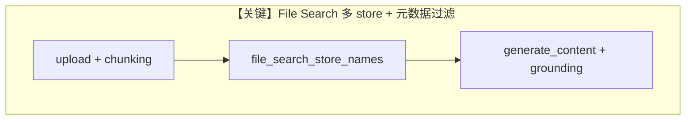

# file_search_advanced.py — 实现原理分析

<!-- cookbook-py-source:start -->
## 完整源码

```python
"""
Google File Search Advanced
===========================

Cookbook example for `google/gemini/file_search_advanced.py`.
"""

from pathlib import Path

from agno.agent import Agent
from agno.models.google import Gemini

# ---------------------------------------------------------------------------
# Create Agent
# ---------------------------------------------------------------------------

# Create Gemini model
model = Gemini(id="gemini-2.5-flash")

# Create agent
agent = Agent(model=model, markdown=True)

print("=" * 60)
print("Setting up multiple File Search stores...")
print("=" * 60)

# Create two different stores for different types of content
technical_store = model.create_file_search_store(display_name="Technical Documentation")
marketing_store = model.create_file_search_store(display_name="Marketing Content")

print(f"[OK] Created technical store: {technical_store.name}")
print(f"[OK] Created marketing store: {marketing_store.name}")

# Upload files with custom chunking and metadata
print("\n" + "=" * 60)
print("Uploading files with custom configuration...")
print("=" * 60)

# Upload technical document with custom chunking
print("\n1. Uploading technical document...")
tech_operation = model.upload_to_file_search_store(
    file_path=Path(__file__).parent / "documents" / "technical_manual.txt",
    store_name=technical_store.name,
    display_name="Technical Manual v2.0",
    chunking_config={
        "white_space_config": {
            "max_tokens_per_chunk": 300,
            "max_overlap_tokens": 50,
        }
    },
    custom_metadata=[
        {"key": "type", "string_value": "technical"},
        {"key": "version", "numeric_value": 2},
        {"key": "department", "string_value": "engineering"},
    ],
)

# Upload marketing document
print("2. Uploading marketing document...")
marketing_operation = model.upload_to_file_search_store(
    file_path=Path(__file__).parent / "documents" / "product_brochure.txt",
    store_name=marketing_store.name,
    display_name="Product Brochure Q1 2024",
    chunking_config={
        "white_space_config": {
            "max_tokens_per_chunk": 200,
            "max_overlap_tokens": 20,
        }
    },
    custom_metadata=[
        {"key": "type", "string_value": "marketing"},
        {"key": "quarter", "string_value": "Q1"},
        {"key": "year", "numeric_value": 2024},
    ],
)

# Wait for both uploads
print("\nWaiting for uploads to complete...")
model.wait_for_operation(tech_operation)
print("[OK] Technical document uploaded")
model.wait_for_operation(marketing_operation)
print("[OK] Marketing document uploaded")

# List documents in each store
print("\n" + "=" * 60)
print("Document Management")
print("=" * 60)

print("\nTechnical Store Documents:")
tech_docs = model.list_documents(technical_store.name)
for doc in tech_docs:
    print(f"  - {doc.display_name} ({doc.name})")

print("\nMarketing Store Documents:")
marketing_docs = model.list_documents(marketing_store.name)
for doc in marketing_docs:
    print(f"  - {doc.display_name} ({doc.name})")

# Query with metadata filtering - Technical docs only
print("\n" + "=" * 60)
print("Query 1: Technical documentation with metadata filter")
print("=" * 60)

model.file_search_store_names = [technical_store.name]
model.file_search_metadata_filter = 'type="technical" AND version=2'

run1 = agent.run(
    "What are the technical specifications mentioned in the documentation?"
)
print(f"\nResponse:\n{run1.content}")

if run1.citations and run1.citations.raw:
    print("\nCitations:")
    print("=" * 50)
    grounding_metadata = run1.citations.raw.get("grounding_metadata", {})
    sources = set()
    for chunk in grounding_metadata.get("grounding_chunks", []) or []:
        if isinstance(chunk, dict) and chunk.get("retrieved_context"):
            rc = chunk["retrieved_context"]
            sources.add(rc.get("title", "Unknown"))
    if sources:
        print(f"\nSources ({len(sources)}):")
        for i, source in enumerate(sorted(sources), 1):
            print(f"  [{i}] {source}")

# Query across multiple stores
print("\n" + "=" * 60)
print("Query 2: Search across both stores")
print("=" * 60)

model.file_search_store_names = [technical_store.name, marketing_store.name]
model.file_search_metadata_filter = None  # Remove filter

run2 = agent.run("What are the key product features and how do they work?")
print(f"\nResponse:\n{run2.content}")

if run2.citations and run2.citations.raw:
    print("\nCitations:")
    print("=" * 50)
    grounding_metadata = run2.citations.raw.get("grounding_metadata", {})
    chunks = grounding_metadata.get("grounding_chunks", []) or []

    sources = set()
    for chunk in chunks:
        if isinstance(chunk, dict) and chunk.get("retrieved_context"):
            rc = chunk["retrieved_context"]
            sources.add(rc.get("title", "Unknown"))

    if sources:
        print(f"\nSources ({len(sources)}):")
        for i, source in enumerate(sorted(sources), 1):
            print(f"  [{i}] {source}")

        print(f"\nDetailed Citations ({len(chunks)}):")
        for i, chunk in enumerate(chunks, 1):
            if isinstance(chunk, dict) and chunk.get("retrieved_context"):
                rc = chunk["retrieved_context"]
                print(f"\n  [{i}] {rc.get('title', 'Unknown')}")
                if rc.get("uri"):
                    print(f"      URI: {rc['uri']}")
                print("      Type: file_search")
                if rc.get("text"):
                    text = rc["text"]
                    if len(text) > 200:
                        text = text[:200] + "..."
                    print(f"      Text: {text}")

# Update document metadata (API not yet available)
print("\n" + "=" * 60)
print("Document metadata management...")
print("=" * 60)

if tech_docs:
    print(f"[OK] Document retrieved: {tech_docs[0].display_name}")
    print(f"  Document ID: {tech_docs[0].name}")
    # Note: Document update API is not yet available in the current SDK version
    print("  (Metadata update API coming soon)")

# Cleanup
print("\n" + "=" * 60)
print("Cleaning up...")
print("=" * 60)

model.delete_file_search_store(technical_store.name)
print(f"[OK] Deleted {technical_store.name}")

model.delete_file_search_store(marketing_store.name)
print(f"[OK] Deleted {marketing_store.name}")

print("\n[OK] Example completed successfully!")

# ---------------------------------------------------------------------------
# Run Agent
# ---------------------------------------------------------------------------

if __name__ == "__main__":
    pass
```

<!-- cookbook-py-source:end -->

> 源文件：`cookbook/90_models/google/gemini/file_search_advanced.py`

## 概述

**Gemini File Search**：多 store、自定义 chunking/metadata、`file_search_metadata_filter`，`agent.run` 查询并解析 `run.citations.raw` 中 grounding。

**核心配置一览：**

| 配置项 | 值 | 说明 |
|--------|------|------|
| `model` | `Gemini(id="gemini-2.5-flash")` | 含 `create_file_search_store`、`upload_to_file_search_store` 等 |
| `agent` | `Agent(model=model, markdown=True)` | |

## 运行机制与因果链

1. 创建两个 store，上传技术/营销文档并等待 operation。
2. 设置 `model.file_search_store_names` 与 `model.file_search_metadata_filter` 后调用 `agent.run`。
3. 从 `citations.raw["grounding_metadata"]` 提取引用。

## 完整 API 请求

底层为 `generate_content`，并带 File Search 工具/配置（见 `Gemini.get_request_params` 与 google-genai）。

## Mermaid 流程图



## 关键源码文件索引

| 文件 | 关键函数/类 | 作用 |
|------|------------|------|
| `agno/models/google/gemini.py` | `create_file_search_store` 等 | 扩展方法 |
| `agno/run/agent.py` | `RunOutput.citations` | 引用 |
