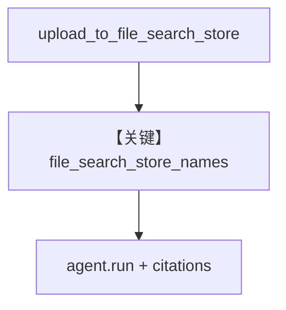

# file_search_basic.py — 实现原理分析

> 源文件：`cookbook/90_models/google/gemini/file_search_basic.py`

## 概述

**单 File Search store**：上传 `documents/sample.txt`，`model.file_search_store_names=[store.name]`，`agent.run` 问答并打印 citations。

**核心配置一览：**

| 配置项 | 值 | 说明 |
|--------|------|------|
| `model` | `Gemini(id="gemini-2.5-flash")` | |
| `agent` | `Agent(model=model, markdown=True)` | |

## Mermaid 流程图

## 关键源码文件索引

| 文件 | 关键函数/类 | 作用 |
|------|------------|------|
| `agno/models/google/gemini.py` | File Search 辅助方法 | store 生命周期 |
