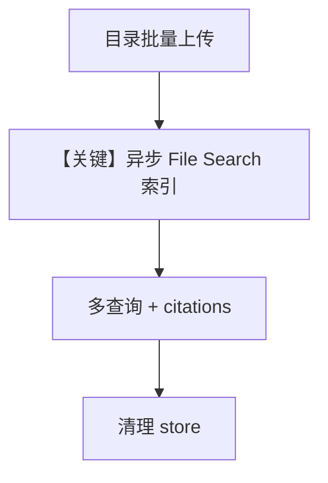

# file_search_rag_pipeline.py — 实现原理分析

> 源文件：`cookbook/90_models/google/gemini/file_search_rag_pipeline.py`

## 概述

**异步 RAG 管道**：`async_create_file_search_store`、`async_upload_to_file_search_store`，按扩展名区分 chunking；`query_with_citations` 内 **`Agent(model=model)` 每次新建**（演示用），多轮查询后 `async_delete_file_search_store`。

**核心配置一览：**

| 配置项 | 值 | 说明 |
|--------|------|------|
| `model` | `Gemini(id="gemini-2.5-flash")` | 异步 API |

## 运行机制与因果链

注意 `query_with_citations` 在循环里创建 Agent——生产应复用 Agent。

## Mermaid 流程图

## 关键源码文件索引

| 文件 | 关键函数/类 | 作用 |
|------|------------|------|
| `agno/models/google/gemini.py` | `async_*_file_search_*` | 异步封装 |
