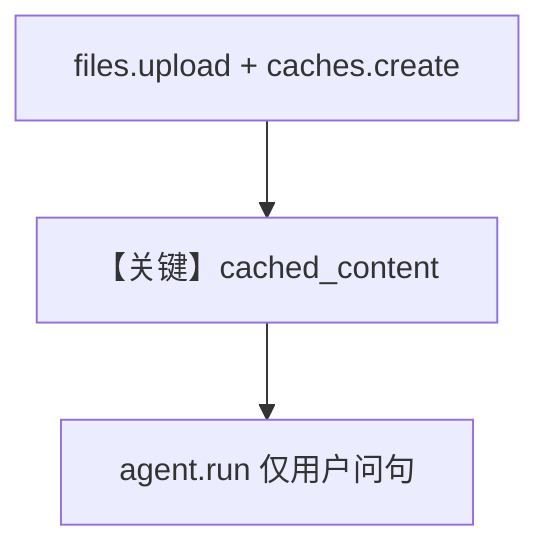

# file_upload_with_cache.py — 实现原理分析

<!-- cookbook-py-source:start -->
## 完整源码

```python
"""
In this example, we upload a text file to Google and then create a cache.

This greatly saves on tokens during normal prompting.
"""

from pathlib import Path
from time import sleep

import requests
from agno.agent import Agent
from agno.models.google import Gemini
from google import genai
from google.genai.types import UploadFileConfig

# ---------------------------------------------------------------------------
# Create Agent
# ---------------------------------------------------------------------------

client = genai.Client()

# Download txt file
url = "https://storage.googleapis.com/generativeai-downloads/data/a11.txt"
path_to_txt_file = Path(__file__).parent.joinpath("a11.txt")
if not path_to_txt_file.exists():
    print("Downloading txt file...")
    with path_to_txt_file.open("wb") as wf:
        response = requests.get(url, stream=True)
        for chunk in response.iter_content(chunk_size=32768):
            wf.write(chunk)

# Upload the txt file using the Files API
remote_file_path = Path("a11.txt")
remote_file_name = f"files/{remote_file_path.stem.lower().replace('_', '-')}"

txt_file = None
try:
    txt_file = client.files.get(name=remote_file_name)
    print(f"Txt file exists: {txt_file.uri}")
except Exception:
    pass

if not txt_file:
    print("Uploading txt file...")
    txt_file = client.files.upload(
        file=path_to_txt_file, config=UploadFileConfig(name=remote_file_name)
    )

    # Wait for the file to finish processing
    while txt_file and txt_file.state and txt_file.state.name == "PROCESSING":
        print("Waiting for txt file to be processed.")
        sleep(2)
        txt_file = client.files.get(name=remote_file_name)

    print(f"Txt file processing complete: {txt_file.uri}")

# Create a cache with 5min TTL
cache = client.caches.create(
    model="gemini-3-flash-preview",
    config={
        "system_instruction": "You are an expert at analyzing transcripts.",
        "contents": [txt_file],
        "ttl": "300s",
    },
)

# ---------------------------------------------------------------------------
# Run Agent
# ---------------------------------------------------------------------------

if __name__ == "__main__":
    agent = Agent(
        model=Gemini(id="gemini-3-flash-preview", cached_content=cache.name),
    )
    run_output = agent.run(
        "Find a lighthearted moment from this transcript",  # No need to pass the txt file
    )
    print("Metrics: ", run_output.metrics)
```

<!-- cookbook-py-source:end -->

> 源文件：`cookbook/90_models/google/gemini/file_upload_with_cache.py`

## 概述

**Google GenAI 缓存**：`genai.Client().caches.create` 绑定上传文件与 `system_instruction`，再以 **`Gemini(..., cached_content=cache.name)`** 提问，减少重复 token。`Agent` 仅在 `if __name__` 块内构造。

**核心配置一览：**

| 配置项 | 值 | 说明 |
|--------|------|------|
| `model` | `Gemini(id="gemini-3-flash-preview", cached_content=cache.name)` | 缓存名来自 `caches.create` |

## 运行机制与因果链

用户问题不再重复附带全文文件；缓存 TTL `300s`。

## 完整 API 请求

`generate_content` 使用 `cached_content` 引用（见 Google GenAI SDK）。

## Mermaid 流程图



## 关键源码文件索引

| 文件 | 关键函数/类 | 作用 |
|------|------------|------|
| `agno/models/google/gemini.py` | `Gemini` `cached_content` 字段 | 请求参数 |
