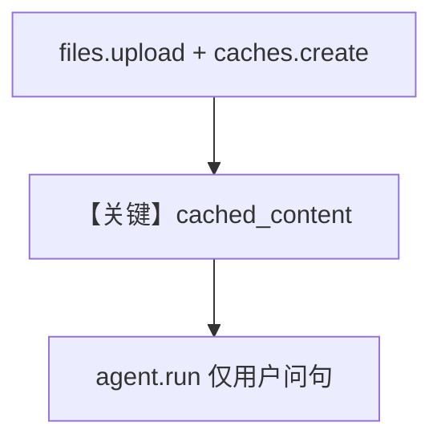

# file_upload_with_cache.py — 实现原理分析

> 源文件：`cookbook/90_models/google/gemini/file_upload_with_cache.py`

## 概述

**Google GenAI 缓存**：`genai.Client().caches.create` 绑定上传文件与 `system_instruction`，再以 **`Gemini(..., cached_content=cache.name)`** 提问，减少重复 token。`Agent` 仅在 `if __name__` 块内构造。

**核心配置一览：**

| 配置项 | 值 | 说明 |
|--------|------|------|
| `model` | `Gemini(id="gemini-3-flash-preview", cached_content=cache.name)` | 缓存名来自 `caches.create` |

## 运行机制与因果链

用户问题不再重复附带全文文件；缓存 TTL `300s`。

## 完整 API 请求

`generate_content` 使用 `cached_content` 引用（见 Google GenAI SDK）。

## Mermaid 流程图

## 关键源码文件索引

| 文件 | 关键函数/类 | 作用 |
|------|------------|------|
| `agno/models/google/gemini.py` | `Gemini` `cached_content` 字段 | 请求参数 |
