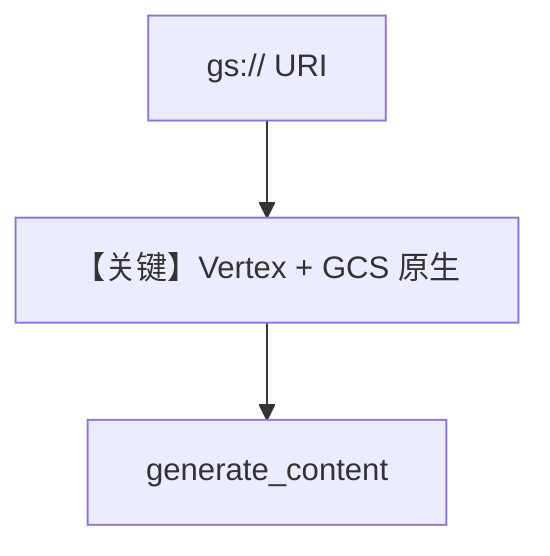

# gcs_file_input.py — 实现原理分析

<!-- cookbook-py-source:start -->
## 完整源码

```python
"""
Example: Analyze files directly from Google Cloud Storage (GCS).

The Gemini API now supports GCS URIs natively (up to 2GB).
No need to download or re-upload - just pass the gs:// URI directly.

Requirements:
- Vertex AI must be enabled (GCS URIs require OAuth, not API keys)
- Run: gcloud auth application-default login
- Set environment variables: GOOGLE_CLOUD_PROJECT, GOOGLE_CLOUD_LOCATION
- Your GCS bucket must be accessible to your credentials

Supported formats: PDF, JSON, HTML, CSS, XML, images (PNG, JPEG, WebP, GIF)
"""

from agno.agent import Agent
from agno.media import File
from agno.models.google import Gemini

# ---------------------------------------------------------------------------
# Create Agent
# ---------------------------------------------------------------------------

# GCS requires Vertex AI (OAuth credentials), not API keys
# Set GOOGLE_CLOUD_PROJECT and GOOGLE_CLOUD_LOCATION env vars
agent = Agent(
    model=Gemini(
        id="gemini-3-flash-preview",
        vertexai=True,
    ),
    markdown=True,
)

# Pass GCS URI directly - no download or re-upload needed
agent.print_response(
    "Summarize this document and extract key insights.",
    files=[
        File(
            url="gs://cloud-samples-data/generative-ai/pdf/2312.11805v3.pdf",  # Sample PDF
            mime_type="application/pdf",
        )
    ],
)

# ---------------------------------------------------------------------------
# Run Agent
# ---------------------------------------------------------------------------

if __name__ == "__main__":
    pass
```

<!-- cookbook-py-source:end -->

> 源文件：`cookbook/90_models/google/gemini/gcs_file_input.py`

## 概述

**GCS `gs://` URI**：需 **Vertex AI + OAuth**（`vertexai=True`），环境变量 `GOOGLE_CLOUD_PROJECT` / `GOOGLE_CLOUD_LOCATION`。

**核心配置一览：**

| 配置项 | 值 | 说明 |
|--------|------|------|
| `model` | `Gemini(id="gemini-3-flash-preview", vertexai=True)` | |
| `files` | `File(url="gs://...", mime_type="application/pdf")` | |

## Mermaid 流程图



## 关键源码文件索引

| 文件 | 关键函数/类 | 作用 |
|------|------------|------|
| `agno/models/google/gemini.py` | `vertexai` / `get_client` | 端点与认证 |
