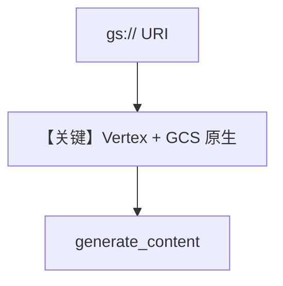

# gcs_file_input.py — 实现原理分析

> 源文件：`cookbook/90_models/google/gemini/gcs_file_input.py`

## 概述

**GCS `gs://` URI**：需 **Vertex AI + OAuth**（`vertexai=True`），环境变量 `GOOGLE_CLOUD_PROJECT` / `GOOGLE_CLOUD_LOCATION`。

**核心配置一览：**

| 配置项 | 值 | 说明 |
|--------|------|------|
| `model` | `Gemini(id="gemini-3-flash-preview", vertexai=True)` | |
| `files` | `File(url="gs://...", mime_type="application/pdf")` | |

## Mermaid 流程图

## 关键源码文件索引

| 文件 | 关键函数/类 | 作用 |
|------|------------|------|
| `agno/models/google/gemini.py` | `vertexai` / `get_client` | 端点与认证 |
