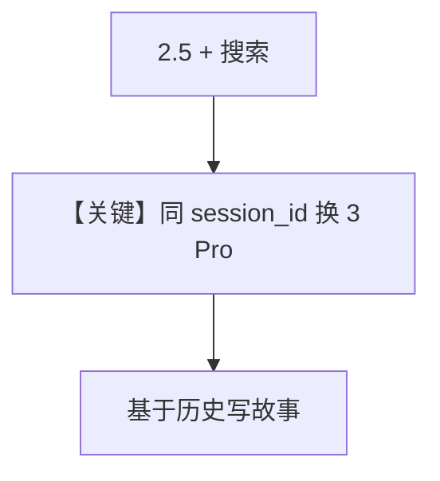

# gemini_2_to_3.py — 实现原理分析

<!-- cookbook-py-source:start -->
## 完整源码

```python
"""
Async example using Gemini with tool calls.
"""

import asyncio
from uuid import uuid4

from agno.agent import Agent
from agno.db.sqlite.sqlite import SqliteDb
from agno.models.google import Gemini
from agno.tools.websearch import WebSearchTools

# ---------------------------------------------------------------------------
# Create Agent
# ---------------------------------------------------------------------------

session_id = str(uuid4())

agent = Agent(
    model=Gemini(id="gemini-2.5-flash"),
    db=SqliteDb(db_file="tmp/data.db"),
    tools=[WebSearchTools()],
    markdown=True,
    add_history_to_context=True,
)

asyncio.run(
    agent.aprint_response(
        "Whats the current news in France?", session_id=session_id, stream=True
    )
)

# Create a new agent with Gemini 3 Pro and re-use the history from the previous session
agent = Agent(
    model=Gemini(id="gemini-3-pro-preview"),
    db=SqliteDb(db_file="tmp/data.db"),
    markdown=True,
    add_history_to_context=True,
)
asyncio.run(
    agent.aprint_response(
        "Write a 2 sentence story the biggest news highlight in our conversation.",
        session_id=session_id,
        stream=True,
    )
)

# ---------------------------------------------------------------------------
# Run Agent
# ---------------------------------------------------------------------------

if __name__ == "__main__":
    pass
```

<!-- cookbook-py-source:end -->

> 源文件：`cookbook/90_models/google/gemini/gemini_2_to_3.py`

## 概述

**同一会话从 Gemini 2.5 切到 3 Pro**：共享 `SqliteDb` 与 `session_id`，首轮 `gemini-2.5-flash` + 工具，次轮 `gemini-3-pro-preview` 仅聊天读历史。

**核心配置一览：**

| 配置项 | 值 | 说明 |
|--------|------|------|
| 第一轮 `model` | `Gemini(id="gemini-2.5-flash")` + `WebSearchTools` | |
| 第二轮 `model` | `Gemini(id="gemini-3-pro-preview")` | 无 tools |
| `db` | `SqliteDb(db_file="tmp/data.db")` | |
| `add_history_to_context` | `True` | |

## 运行机制与因果链

两次 **`Agent(...)` 重新构造**：演示「换模型续聊」；注意复用 `session_id`。

## Mermaid 流程图



## 关键源码文件索引

| 文件 | 关键函数/类 | 作用 |
|------|------------|------|
| `agno/db/sqlite/sqlite.py` | `SqliteDb` | 会话 |
| `agno/models/google/gemini.py` | `Gemini` | 多版本模型 |
