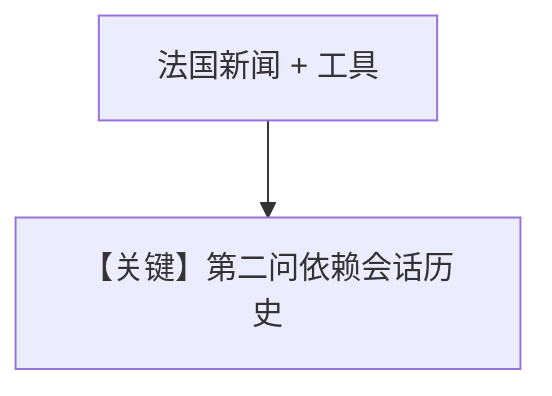

# gemini_3_pro.py — 实现原理分析

> 源文件：`cookbook/90_models/google/gemini/gemini_3_pro.py`

## 概述

**`gemini-3-pro-preview` + WebSearch + 历史**：单 Agent 配置，异步 `aprint_response` 流式与非流式各一次。

**核心配置一览：**

| 配置项 | 值 | 说明 |
|--------|------|------|
| `model` | `Gemini(id="gemini-3-pro-preview")` | |
| `tools` | `[WebSearchTools()]` | |
| `db` | `SqliteDb(db_file="tmp/data.db")` | |
| `add_history_to_context` | `True` | |

## Mermaid 流程图

## 关键源码文件索引

| 文件 | 关键函数/类 | 作用 |
|------|------------|------|
| `agno/models/google/gemini.py` | `invoke` / `ainvoke` | |
