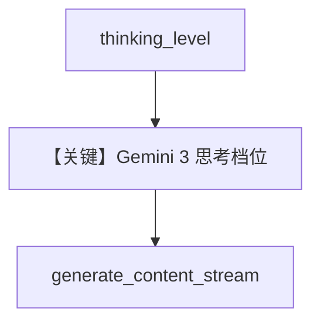

# gemini_3_pro_thinking_level.py — 实现原理分析

> 源文件：`cookbook/90_models/google/gemini/gemini_3_pro_thinking_level.py`

## 概述

**`thinking_level="low"`** 控制 Gemini 3 Pro 推理深度，`gemini-3-pro-preview`。

**核心配置一览：**

| 配置项 | 值 | 说明 |
|--------|------|------|
| `model` | `Gemini(id="gemini-3-pro-preview", thinking_level="low")` | |
| `markdown` | `True` | |

## Mermaid 流程图

## 关键源码文件索引

| 文件 | 关键函数/类 | 作用 |
|------|------------|------|
| `agno/models/google/gemini.py` | `get_request_params` | thinking_level |
