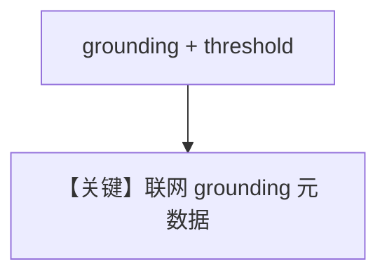

# grounding.py — 实现原理分析

> 源文件：`cookbook/90_models/google/gemini/grounding.py`

## 概述

**旧版 Grounding 工具**（注释建议 Gemini 2.0+ 优先考虑 `search` 参数）。`grounding=True`，`grounding_dynamic_threshold=0.7`，`add_datetime_to_context=True`。

**核心配置一览：**

| 配置项 | 值 | 说明 |
|--------|------|------|
| `model` | `Gemini(id="gemini-3-flash-preview", grounding=True, grounding_dynamic_threshold=0.7)` | |
| `add_datetime_to_context` | `True` | system 含当前时间 `# 3.2.2` |

## System Prompt 组装

除默认段外，含 **当前时间**（动态，非静态字面量）。

### 还原后的完整 System 文本

时间串为运行时生成，例如 `The current time is ...`（见 `_messages.py` `# 3.2.2`）。

## Mermaid 流程图

## 关键源码文件索引

| 文件 | 关键函数/类 | 作用 |
|------|------------|------|
| `agno/models/google/gemini.py` | `grounding` 请求字段 | |
