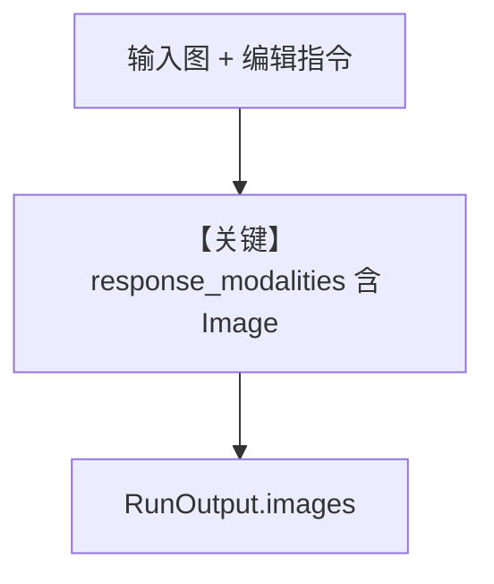

# image_editing.py — 实现原理分析

> 源文件：`cookbook/90_models/google/gemini/image_editing.py`

## 概述

**图像编辑**：`response_modalities=["Text", "Image"]`，输入 `Image(filepath="tmp/test_photo.png")`，从 `RunOutput.images` 取字节。注释称不宜额外 system——**代码仍使用默认 `build_context`**，且 **`markdown` 未设**，故无 Markdown 附加段。

**核心配置一览：**

| 配置项 | 值 | 说明 |
|--------|------|------|
| `model` | `Gemini(id="gemini-3-flash-preview", response_modalities=["Text", "Image"])` | 多模态输出 |

## 运行机制与因果链

`get_last_run_output()` 取图像；PIL 展示/保存。

## Mermaid 流程图

## 关键源码文件索引

| 文件 | 关键函数/类 | 作用 |
|------|------------|------|
| `agno/models/google/gemini.py` | `_parse_provider_response` | 图像部分 |
