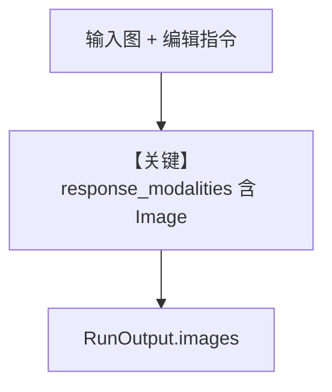

# image_editing.py — 实现原理分析

<!-- cookbook-py-source:start -->
## 完整源码

```python
"""
Google Image Editing
====================

Cookbook example for `google/gemini/image_editing.py`.
"""

from io import BytesIO

from agno.agent import Agent, RunOutput  # noqa
from agno.media import Image
from agno.models.google import Gemini
from PIL import Image as PILImage

# ---------------------------------------------------------------------------
# Create Agent
# ---------------------------------------------------------------------------

# No system message should be provided (Gemini requires only the image)
agent = Agent(
    model=Gemini(
        id="gemini-3-flash-preview",
        response_modalities=["Text", "Image"],
    )
)

# Print the response in the terminal
response = agent.run(
    "Can you add a Llama in the background of this image?",
    images=[Image(filepath="tmp/test_photo.png")],
)

# Retrieve and display generated images using get_last_run_output
run_response = agent.get_last_run_output()
if run_response and isinstance(run_response, RunOutput) and run_response.images:
    for image_response in run_response.images:
        image_bytes = image_response.content
        if image_bytes:
            image = PILImage.open(BytesIO(image_bytes))
            image.show()
            # Save the image to a file
            # image.save("generated_image.png")
else:
    print("No images found in run response")

# ---------------------------------------------------------------------------
# Run Agent
# ---------------------------------------------------------------------------
if __name__ == "__main__":
    pass
```

<!-- cookbook-py-source:end -->

> 源文件：`cookbook/90_models/google/gemini/image_editing.py`

## 概述

**图像编辑**：`response_modalities=["Text", "Image"]`，输入 `Image(filepath="tmp/test_photo.png")`，从 `RunOutput.images` 取字节。注释称不宜额外 system——**代码仍使用默认 `build_context`**，且 **`markdown` 未设**，故无 Markdown 附加段。

**核心配置一览：**

| 配置项 | 值 | 说明 |
|--------|------|------|
| `model` | `Gemini(id="gemini-3-flash-preview", response_modalities=["Text", "Image"])` | 多模态输出 |

## 运行机制与因果链

`get_last_run_output()` 取图像；PIL 展示/保存。

## Mermaid 流程图



## 关键源码文件索引

| 文件 | 关键函数/类 | 作用 |
|------|------------|------|
| `agno/models/google/gemini.py` | `_parse_provider_response` | 图像部分 |
