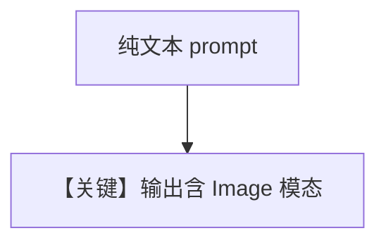

# image_generation.py — 实现原理分析

> 源文件：`cookbook/90_models/google/gemini/image_generation.py`

## 概述

**文生图**：`response_modalities=["Text", "Image"]`，`run("Make me an image of a cat in a tree.")`，解析 `run_response.images`。

**核心配置一览：**

| 配置项 | 值 | 说明 |
|--------|------|------|
| `model` | `Gemini(id="gemini-3-flash-preview", response_modalities=["Text", "Image"])` | |

## Mermaid 流程图

## 关键源码文件索引

| 文件 | 关键函数/类 | 作用 |
|------|------------|------|
| `agno/models/google/gemini.py` | 响应解析 | images |
