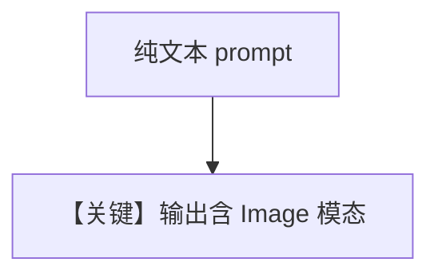

# image_generation.py — 实现原理分析

<!-- cookbook-py-source:start -->
## 完整源码

```python
"""
Google Image Generation
=======================

Cookbook example for `google/gemini/image_generation.py`.
"""

from io import BytesIO

from agno.agent import Agent, RunOutput  # noqa
from agno.models.google import Gemini
from PIL import Image

# ---------------------------------------------------------------------------
# Create Agent
# ---------------------------------------------------------------------------

# No system message should be provided
agent = Agent(
    model=Gemini(
        id="gemini-3-flash-preview",
        response_modalities=["Text", "Image"],
    )
)

# Print the response in the terminal
run_response = agent.run("Make me an image of a cat in a tree.")

if run_response and isinstance(run_response, RunOutput) and run_response.images:
    for image_response in run_response.images:
        image_bytes = image_response.content
        if image_bytes:
            image = Image.open(BytesIO(image_bytes))
            image.show()
            # Save the image to a file
            # image.save("generated_image.png")
else:
    print("No images found in run response")

# ---------------------------------------------------------------------------
# Run Agent
# ---------------------------------------------------------------------------
if __name__ == "__main__":
    pass
```

<!-- cookbook-py-source:end -->

> 源文件：`cookbook/90_models/google/gemini/image_generation.py`

## 概述

**文生图**：`response_modalities=["Text", "Image"]`，`run("Make me an image of a cat in a tree.")`，解析 `run_response.images`。

**核心配置一览：**

| 配置项 | 值 | 说明 |
|--------|------|------|
| `model` | `Gemini(id="gemini-3-flash-preview", response_modalities=["Text", "Image"])` | |

## Mermaid 流程图



## 关键源码文件索引

| 文件 | 关键函数/类 | 作用 |
|------|------------|------|
| `agno/models/google/gemini.py` | 响应解析 | images |
