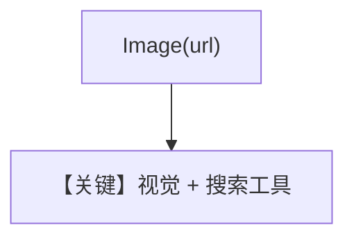

# image_input.py — 实现原理分析

> 源文件：`cookbook/90_models/google/gemini/image_input.py`

## 概述

**图像 URL + WebSearch**：`gemini-2.0-flash-exp`，先识图再联网。

**核心配置一览：**

| 配置项 | 值 | 说明 |
|--------|------|------|
| `model` | `Gemini(id="gemini-2.0-flash-exp")` | |
| `tools` | `[WebSearchTools()]` | |
| `markdown` | `True` | |

## Mermaid 流程图

## 关键源码文件索引

| 文件 | 关键函数/类 | 作用 |
|------|------------|------|
| `agno/models/google/gemini.py` | `invoke` | generate_content |
