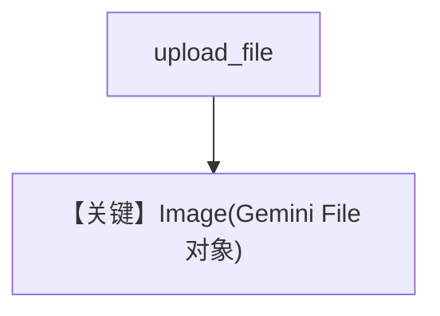

# image_input_file_upload.py — 实现原理分析

<!-- cookbook-py-source:start -->
## 完整源码

```python
"""
Google Image Input File Upload
==============================

Cookbook example for `google/gemini/image_input_file_upload.py`.
"""

from pathlib import Path

from agno.agent import Agent
from agno.media import Image
from agno.models.google import Gemini
from agno.tools.websearch import WebSearchTools
from google.generativeai import upload_file
from google.generativeai.types import file_types

# ---------------------------------------------------------------------------
# Create Agent
# ---------------------------------------------------------------------------

agent = Agent(
    model=Gemini(id="gemini-2.0-flash-exp"),
    tools=[WebSearchTools()],
    markdown=True,
)
# Please download the image using
# wget https://upload.wikimedia.org/wikipedia/commons/b/bf/Krakow_-_Kosciol_Mariacki.jpg
image_path = Path(__file__).parent.joinpath("Krakow_-_Kosciol_Mariacki.jpg")
image_file: file_types.File = upload_file(image_path)
print(f"Uploaded image: {image_file}")

agent.print_response(
    "Tell me about this image and give me the latest news about it.",
    images=[Image(content=image_file)],
    stream=True,
)

# ---------------------------------------------------------------------------
# Run Agent
# ---------------------------------------------------------------------------

if __name__ == "__main__":
    pass
```

<!-- cookbook-py-source:end -->

> 源文件：`cookbook/90_models/google/gemini/image_input_file_upload.py`

## 概述

**`google.generativeai.upload_file`** 上传本地图，再 `Image(content=image_file)`，`gemini-2.0-flash-exp` + WebSearch。

**核心配置一览：**

| 配置项 | 值 | 说明 |
|--------|------|------|
| `model` | `Gemini(id="gemini-2.0-flash-exp")` | |
| `tools` | `[WebSearchTools()]` | |

## Mermaid 流程图



## 关键源码文件索引

| 文件 | 关键函数/类 | 作用 |
|------|------------|------|
| `agno/media/image.py` | `Image` | content 类型 |
