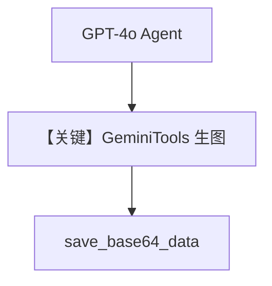

# imagen_tool.py — 实现原理分析

<!-- cookbook-py-source:start -->
## 完整源码

```python
"""Example: Using the GeminiTools Toolkit for Image Generation

Make sure you have set the GOOGLE_API_KEY environment variable.
Example prompts to try:
- "Create a surreal painting of a floating city in the clouds at sunset"
- "Generate a photorealistic image of a cozy coffee shop interior"
- "Design a cute cartoon mascot for a tech startup, vector style"
- "Create an artistic portrait of a cyberpunk samurai in a rainy city"

Run `uv pip install google-genai agno` to install the necessary dependencies.
"""

from agno.agent import Agent
from agno.models.openai import OpenAIChat
from agno.tools.models.gemini import GeminiTools
from agno.utils.media import save_base64_data

# ---------------------------------------------------------------------------
# Create Agent
# ---------------------------------------------------------------------------

agent = Agent(
    model=OpenAIChat(id="gpt-4o"),
    tools=[GeminiTools()],
)

agent.print_response(
    "Create an artistic portrait of a cyberpunk samurai in a rainy city",
)
response = agent.run_response
if response and response.images:
    save_base64_data(str(response.images[0].content), "tmp/cyberpunk_samurai.png")

# ---------------------------------------------------------------------------
# Run Agent
# ---------------------------------------------------------------------------

if __name__ == "__main__":
    pass
```

<!-- cookbook-py-source:end -->

> 源文件：`cookbook/90_models/google/gemini/imagen_tool.py`

## 概述

**注意**：主模型为 **`OpenAIChat(id="gpt-4o")`**，**非** `Gemini` 类；工具为 **`GeminiTools()`**，由 GPT-4o 调度以调用 Gemini 生图 API，`save_base64_data` 落盘。

**核心配置一览：**

| 配置项 | 值 | 说明 |
|--------|------|------|
| `model` | `OpenAIChat(id="gpt-4o")` | Chat Completions |
| `tools` | `[GeminiTools()]` | 封装 Imagen/Gemini 生图 |

## System Prompt 组装

走 **OpenAI** 适配器默认 system，非 `Gemini.get_request_params`；本节不适用「Gemini generate_content」作为主路径。

## 完整 API 请求

外层：`chat.completions.create`（OpenAI）；工具执行内部再调 Google GenAI。

## Mermaid 流程图



## 关键源码文件索引

| 文件 | 关键函数/类 | 作用 |
|------|------------|------|
| `agno/tools/models/gemini.py` | `GeminiTools` | 生图工具 |
| `agno/models/openai/chat.py` | `invoke()` | 外层 LLM |
