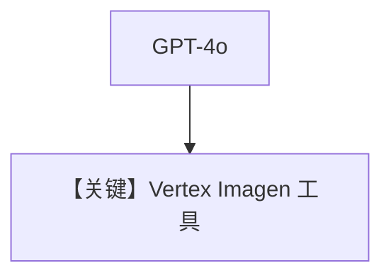

# imagen_tool_advanced.py — 实现原理分析

> 源文件：`cookbook/90_models/google/gemini/imagen_tool_advanced.py`

## 概述

与 `imagen_tool.py` 相同模式：**`OpenAIChat` + `GeminiTools(vertexai=True, image_generation_model="imagen-4.0-generate-preview-05-20")`**，长 prompt 文生图。

**核心配置一览：**

| 配置项 | 值 | 说明 |
|--------|------|------|
| `model` | `OpenAIChat(id="gpt-4o")` | |
| `tools` | `[GeminiTools(..., vertexai=True, image_generation_model=...)]` | Vertex Imagen |

## System Prompt 组装

OpenAI Chat 路径；非直连 Gemini `Agent`。

## Mermaid 流程图

## 关键源码文件索引

| 文件 | 关键函数/类 | 作用 |
|------|------------|------|
| `agno/tools/models/gemini.py` | `GeminiTools` | Vertex 配置 |
