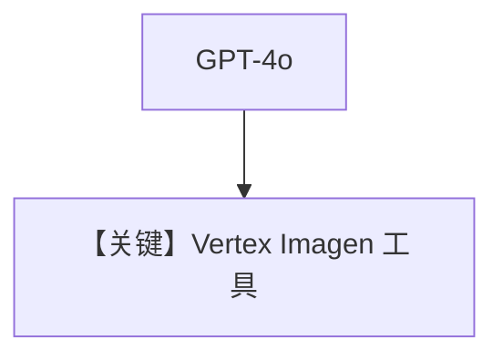

# imagen_tool_advanced.py — 实现原理分析

<!-- cookbook-py-source:start -->
## 完整源码

```python
"""Example: Using the GeminiTools Toolkit for Image Generation

An Agent using the Gemini image generation tool.

Make sure to set the Vertex AI credentials. Here's the authentication guide: https://cloud.google.com/sdk/docs/initializing

Run `uv pip install google-genai agno` to install the required packages.
"""

from agno.agent import Agent
from agno.models.openai import OpenAIChat
from agno.tools.models.gemini import GeminiTools
from agno.utils.media import save_base64_data

# ---------------------------------------------------------------------------
# Create Agent
# ---------------------------------------------------------------------------

agent = Agent(
    model=OpenAIChat(id="gpt-4o"),
    tools=[
        GeminiTools(
            image_generation_model="imagen-4.0-generate-preview-05-20", vertexai=True
        )
    ],
)

agent.print_response(
    "Cinematic a visual shot using a stabilized drone flying dynamically alongside a pod of immense baleen whales as they breach spectacularly in deep offshore waters. The camera maintains a close, dramatic perspective as these colossal creatures launch themselves skyward from the dark blue ocean, creating enormous splashes and showering cascades of water droplets that catch the sunlight. In the background, misty, fjord-like coastlines with dense coniferous forests provide context. The focus expertly tracks the whales, capturing their surprising agility, immense power, and inherent grace. The color palette features the deep blues and greens of the ocean, the brilliant white spray, the dark grey skin of the whales, and the muted tones of the distant wild coastline, conveying the thrilling magnificence of marine megafauna."
)

response = agent.run_response
if response and response.images:
    save_base64_data(str(response.images[0].content), "tmp/baleen_whale.png")

"""
Example prompts to try:
- A horizontally oriented rectangular stamp features the Mission District's vibrant culture, portrayed in shades of warm terracotta orange using an etching style. The scene might depict a sun-drenched street like Valencia or Mission Street, lined with a mix of Victorian buildings and newer structures.
- Painterly landscape featuring a simple, isolated wooden cabin nestled amongst tall pine trees on the shore of a calm, reflective lake.
- Filmed cinematically from the driver's seat, offering a clear profile view of the young passenger on the front seat with striking red hair.
- A pile of books seen from above. The topmost book contains a watercolor illustration of a bird. VERTEX AI is written in bold letters on the book.
"""

# ---------------------------------------------------------------------------
# Run Agent
# ---------------------------------------------------------------------------

if __name__ == "__main__":
    pass
```

<!-- cookbook-py-source:end -->

> 源文件：`cookbook/90_models/google/gemini/imagen_tool_advanced.py`

## 概述

与 `imagen_tool.py` 相同模式：**`OpenAIChat` + `GeminiTools(vertexai=True, image_generation_model="imagen-4.0-generate-preview-05-20")`**，长 prompt 文生图。

**核心配置一览：**

| 配置项 | 值 | 说明 |
|--------|------|------|
| `model` | `OpenAIChat(id="gpt-4o")` | |
| `tools` | `[GeminiTools(..., vertexai=True, image_generation_model=...)]` | Vertex Imagen |

## System Prompt 组装

OpenAI Chat 路径；非直连 Gemini `Agent`。

## Mermaid 流程图



## 关键源码文件索引

| 文件 | 关键函数/类 | 作用 |
|------|------------|------|
| `agno/tools/models/gemini.py` | `GeminiTools` | Vertex 配置 |
