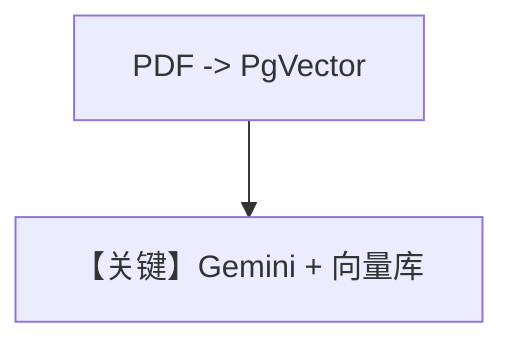

# knowledge.py — 实现原理分析

> 源文件：`cookbook/90_models/google/gemini/knowledge.py`

## 概述

**PgVector + Knowledge + GeminiEmbedder**：PDF 入库，`Agent(model=Gemini(...), knowledge=knowledge)`。**未**设置 `search_knowledge=True`（与 `.cursorrules` 中 agentic RAG 推荐对比，本示例可能依赖默认行为或需读者自行开启）。

**核心配置一览：**

| 配置项 | 值 | 说明 |
|--------|------|------|
| `model` | `Gemini(id="gemini-3-flash-preview")` | |
| `knowledge` | `Knowledge(vector_db=PgVector(..., embedder=GeminiEmbedder()))` | |

## 运行机制与因果链

若需模型主动检索，通常设 `search_knowledge=True`；请以实际 Agent 默认值为准。

## Mermaid 流程图

## 关键源码文件索引

| 文件 | 关键函数/类 | 作用 |
|------|------------|------|
| `agno/knowledge/embedder/google.py` | `GeminiEmbedder` | 嵌入 |
| `agno/vectordb/pgvector/` | `PgVector` | 存储 |
