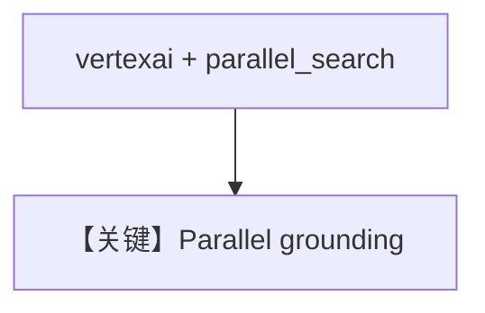

# parallel_grounding.py — 实现原理分析

> 源文件：`cookbook/90_models/google/gemini/parallel_grounding.py`

## 概述

**Vertex AI + `parallel_search=True`**：Parallel Web Search 与 Gemini 原生集成，需 ADC 与 GCP 环境变量。

**核心配置一览：**

| 配置项 | 值 | 说明 |
|--------|------|------|
| `model` | `Gemini(id="gemini-2.0-flash", vertexai=True, parallel_search=True)` | |
| `add_datetime_to_context` | `True` | |
| `markdown` | `True` | |

## Mermaid 流程图

## 关键源码文件索引

| 文件 | 关键函数/类 | 作用 |
|------|------------|------|
| `agno/models/google/gemini.py` | `parallel_search` | 请求字段 |
