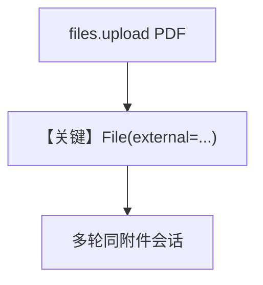

# pdf_input_file_upload.py — 实现原理分析

<!-- cookbook-py-source:start -->
## 完整源码

```python
"""
In this example, we upload a PDF file to Google GenAI directly and then use it as an input to an agent.

Note: If the size of the file is greater than 20MB, and a file path is provided, the file automatically gets uploaded to Google GenAI.
"""

from pathlib import Path
from time import sleep

from agno.agent import Agent
from agno.media import File
from agno.models.google import Gemini
from google import genai

# ---------------------------------------------------------------------------
# Create Agent
# ---------------------------------------------------------------------------

pdf_path = Path(__file__).parent.joinpath("ThaiRecipes.pdf")

client = genai.Client()

# Upload the file to Google GenAI
upload_result = client.files.upload(file=pdf_path)

# Get the file from Google GenAI
if upload_result and upload_result.name:
    retrieved_file = client.files.get(name=upload_result.name)
else:
    retrieved_file = None

# Retry up to 3 times if file is not ready
retries = 0
wait_time = 5
while retrieved_file is None and retries < 3:
    retries += 1
    sleep(wait_time)
    if upload_result and upload_result.name:
        retrieved_file = client.files.get(name=upload_result.name)
    else:
        retrieved_file = None

if retrieved_file is not None:
    agent = Agent(
        model=Gemini(id="gemini-3-flash-preview"),
        markdown=True,
        add_history_to_context=True,
    )

    agent.print_response(
        "Summarize the contents of the attached file.",
        files=[File(external=retrieved_file)],
    )

    agent.print_response(
        "Suggest me a recipe from the attached file.",
    )
else:
    print("Error: File was not ready after multiple attempts.")

# ---------------------------------------------------------------------------
# Run Agent
# ---------------------------------------------------------------------------

if __name__ == "__main__":
    pass
```

<!-- cookbook-py-source:end -->

> 源文件：`cookbook/90_models/google/gemini/pdf_input_file_upload.py`

## 概述

**genai.Client 上传 PDF**，`File(external=retrieved_file)`，Agent 带 `add_history_to_context=True` 两轮追问。

**核心配置一览：**

| 配置项 | 值 | 说明 |
|--------|------|------|
| `model` | `Gemini(id="gemini-3-flash-preview")` | |
| `add_history_to_context` | `True` | |

## Mermaid 流程图



## 关键源码文件索引

| 文件 | 关键函数/类 | 作用 |
|------|------------|------|
| `agno/media/file.py` | `File` | external 引用 |
