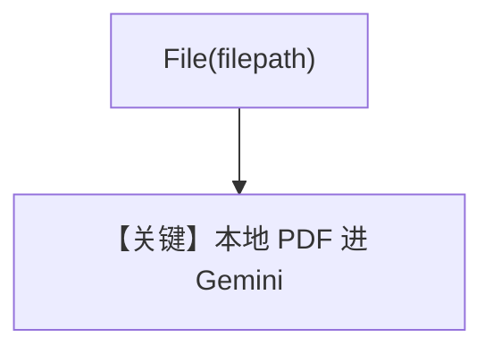

# pdf_input_local.py — 实现原理分析

> 源文件：`cookbook/90_models/google/gemini/pdf_input_local.py`

## 概述

**本地下载 PDF**，`File(filepath=pdf_path)`，大文件可自动上传 Google（见文件头注释），两轮对话。

**核心配置一览：**

| 配置项 | 值 | 说明 |
|--------|------|------|
| `model` | `Gemini(id="gemini-3-flash-preview")` | |
| `add_history_to_context` | `True` | |

## Mermaid 流程图

## 关键源码文件索引

| 文件 | 关键函数/类 | 作用 |
|------|------------|------|
| `agno/utils/media.py` | `download_file` | 拉取 PDF |
