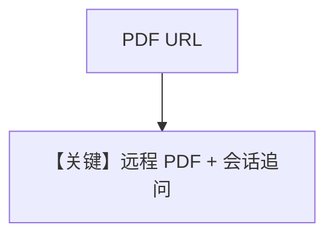

# pdf_input_url.py — 实现原理分析

<!-- cookbook-py-source:start -->
## 完整源码

```python
"""
Google Pdf Input Url
====================

Cookbook example for `google/gemini/pdf_input_url.py`.
"""

from agno.agent import Agent
from agno.db.in_memory import InMemoryDb
from agno.media import File
from agno.models.google import Gemini

# ---------------------------------------------------------------------------
# Create Agent
# ---------------------------------------------------------------------------

agent = Agent(
    model=Gemini(id="gemini-3-flash-preview"),
    markdown=True,
    db=InMemoryDb(),
    add_history_to_context=True,
)

agent.print_response(
    "Summarize the contents of the attached file.",
    files=[File(url="https://agno-public.s3.amazonaws.com/recipes/ThaiRecipes.pdf")],
)

agent.print_response("Suggest me a recipe from the attached file.")

# ---------------------------------------------------------------------------
# Run Agent
# ---------------------------------------------------------------------------

if __name__ == "__main__":
    pass
```

<!-- cookbook-py-source:end -->

> 源文件：`cookbook/90_models/google/gemini/pdf_input_url.py`

## 概述

**HTTPS PDF URL + InMemoryDb**：`File(url=...)`，两轮对话，`add_history_to_context=True`。

**核心配置一览：**

| 配置项 | 值 | 说明 |
|--------|------|------|
| `model` | `Gemini(id="gemini-3-flash-preview")` | |
| `db` | `InMemoryDb()` | 内存会话 |
| `add_history_to_context` | `True` | |

## Mermaid 流程图



## 关键源码文件索引

| 文件 | 关键函数/类 | 作用 |
|------|------------|------|
| `agno/db/in_memory.py` | `InMemoryDb` | |
