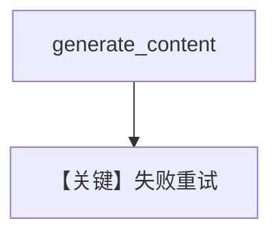

# retry.py — 实现原理分析

> 源文件：`cookbook/90_models/google/gemini/retry.py`

## 概述

**Gemini 重试**：`gemini-wrong-id`，`retries=3` 等。

**核心配置一览：**

| 配置项 | 值 | 说明 |
|--------|------|------|
| `model` | `Gemini(id="gemini-wrong-id", retries=3, delay_between_retries=1, exponential_backoff=True)` | |

## Mermaid 流程图

## 关键源码文件索引

| 文件 | 关键函数/类 | 作用 |
|------|------------|------|
| `agno/models/google/gemini.py` | `invoke()` | |
